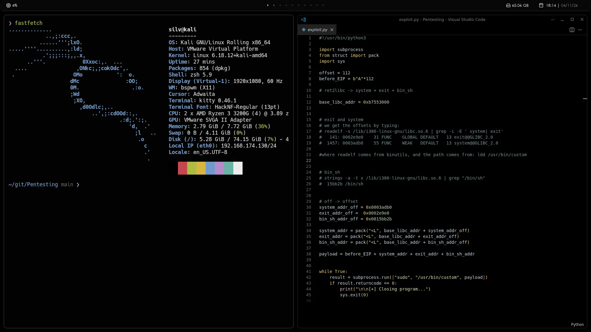

# My dotfiles

Installation guide for my Kali VM with no DE preinstalled.

# Installation

**Base**

```bash
sudo apt update
```

```bash
sudo apt install xorg bspwm sxhkd xinit xterm kitty polybar
```

```bash
echo "exec bspwm" > ~/.xinitrc
```

**Network Stuff**

```bash
sudo apt install network-manager -y
sudo systemctl enable NetworkManager
sudo systemctl start NetworkManager
```

```bash
sudo apt install isc-dchp-client
```

**Utils**

```bash
sudo apt install firefox-esr rofi ranger feh obsidian fastfetch bat lsd
```

# Moving configuration files

**.config**

```bash
mv ~/git/dotfiles/kitty ~/.config/
mv ~/git/dotfiles/polybar ~/.config/
mv ~/git/dotfiles/bspwm ~/.config/
mv ~/git/dotfiles/sxhkd ~/.config/
mv ~/git/dotfiles/rofi ~/.config/
```

**ZSH**

```bash
mv ~/git/dotfiles/zsh/.zshrc ~
```

# Picom

- https://github.com/yshui/picom

```bash
mkdir ~/git
cd !$
git clone https://github.com/yshui/picom
```

Follow installation guide, then:

```bash
mv ~/git/dotfiles/picom ~/.config/
```

# p10k

**for home user**

```bash
git clone --depth=1 https://gitee.com/romkatv/powerlevel10k.git ~/powerlevel10k
```

```bash
mv ~/git/dotfiles/p10k/forUser/.p10k.zsh ~
```

**for root**

```bash
sudo mv ~/git/dotfiles/p10k/forRoot/.p10k.zsh /root/
sudo ln -s /home/silv/powerlevel10k /root/powerlevel10k
```

# Fonts

```bash
sudo mv ~/git/dotfiles/fonts/* /user/local/share/fonts/
```

---

# Showcase



